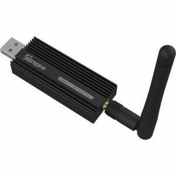

Coming back to what has triggered this blog to an existence: <a href="/blog/0001-post.md">trying</a> to flash Zigbee coordinator firmware.

I am a happy owner of one of those guys:



It is a Sonoff Zigbee 3.0 USB dongle, which is based on Texas Instruments CC2652P chip.

At one point I decided to update its firmware, because the version I was running has been reported unstable and
I had some devices falling off the network from time to time. After some research, I found [this](https://www.zigbee2mqtt.io/guide/adapters/flashing/flashing_via_cc2538-bsl.html).
If you are lazy to read it, here is how I did it:

1. Create the following docker compose file:
   ```yaml
   services:
     ti-cc-tool:
       image: "ckware/ti-cc-tool"
       environment:
         FIRMWARE_URL: "https://github.com/Koenkk/Z-Stack-firmware/releases/download/Z-Stack_3.x.0_coordinator_20240710/CC1352P2_CC2652P_launchpad_coordinator_20240710.zip"
       devices:
         - "/dev/ttyUSB0:/dev/ttyUSB0"
       command: [ "-ewv", "-p", "/dev/ttyUSB0", "--bootloader-sonoff-usb" ]
   ```
2. Run: `docker-compose up`
3. Wait ...
4. Done 🙂

### PS
According to the documentation docker approach is only working on Linux (why would you use anything else anyways?).

